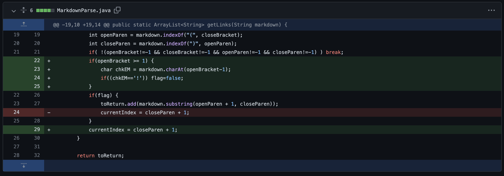
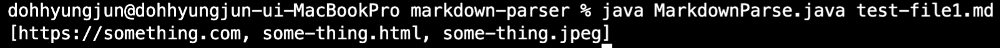
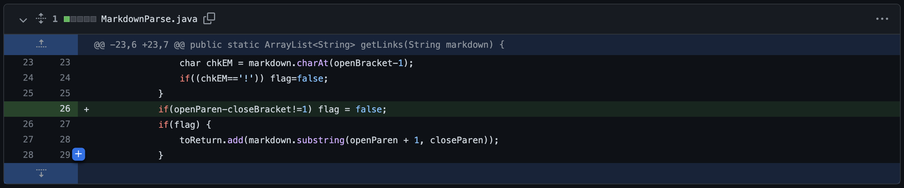
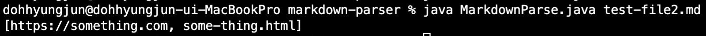
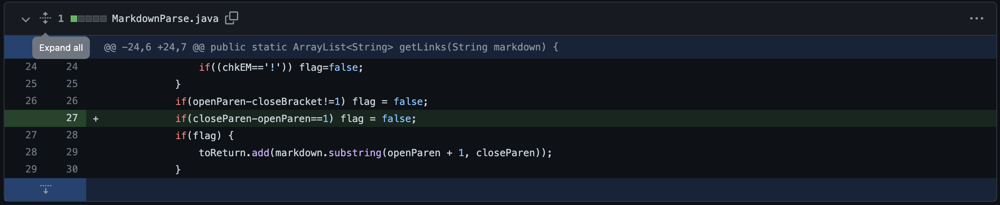
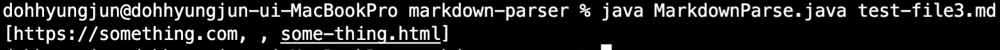

# Hyungjun Doh's Week 4 Lab Report
Show a screenshot of the code change diff from Github (a page like this)  
Link to the test file for a failure-inducing input that prompted you to make that change  
Show the symptom of that failure-inducing input by showing the output of running the file at the command line for the version where it was failing (this should also be in the commit message history)  
Write 2-3 sentences describing the relationship between the bug, the symptom, and the failure-inducing input.  
1. File with an image reference
- code difference  
  
- [Link to the test file for a failure-inducing input](https://github.com/hdoh-ucsd/markdown-parser/blob/main/test-file1.md)  
[symptom for failure-inducing input #1]  

-  There was a bug induced by the program where an edge case of a file with an image reference was not created.  
The following symptom was an image reference "something.jpeg" was included in the result.  
Our group decided to debug this by adding an edge if case that checks that whether there was a exclamation part before the opening bracket.  
If case would make the flag false after checking if the link is an image reference check which avoids from adding the link into the StringList for result.  
***
2.  File that uses [] and (), but very far apart in the file  
- code difference  
  
- [Link to the test file for a failure-inducing input](https://github.com/hdoh-ucsd/markdown-parser/blob/main/test-file2.md)

- There was a bug induced by the program where an edge case of  a link that uses [] and () with unvalid gap between them was created.  
The following symptom was an invalid link with a long gap between brackets and parantheses was also printed.  
Our group decided to debug this by adding an edge if case that checks if the closing bracket and the opening paranthesis is stick together, that is to have an index difference with 1.  
If case would make the flag false if this is not case and avoid adding the link into the StringList for result.
***
3. File with no links
- code difference
  
- [Link to the test file for a failure-inducing input](https://github.com/hdoh-ucsd/markdown-parser/blob/main/test-file3.md)

- There was a bug induced by the program where an edge case of a link with no link.  
The following symptom was an empty comma was added to the result.  
Our group decided to debug this by adding an edge if case that checks if the opening paranthesis and the closing paranthesis is not stick together, that is to not have an index difference with 1.  
If they are stick together the flag would avoid adding the link into the StringList for result.  

