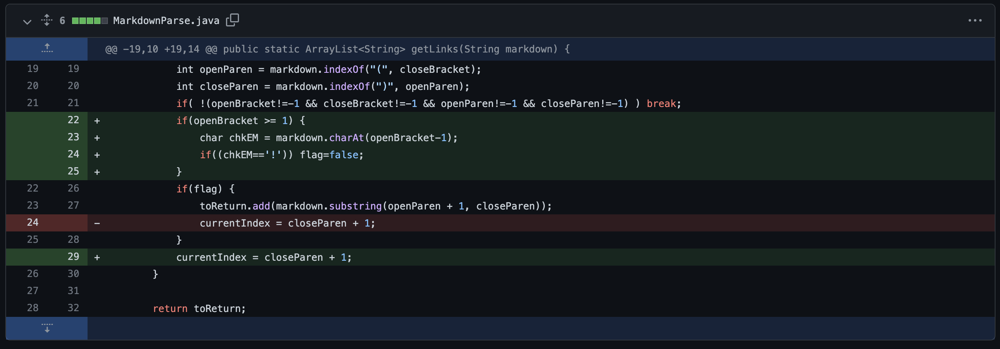
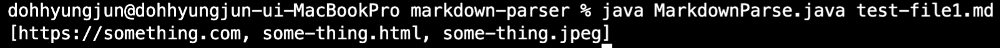
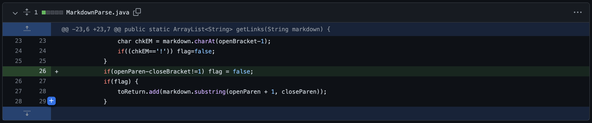
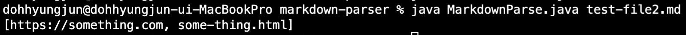
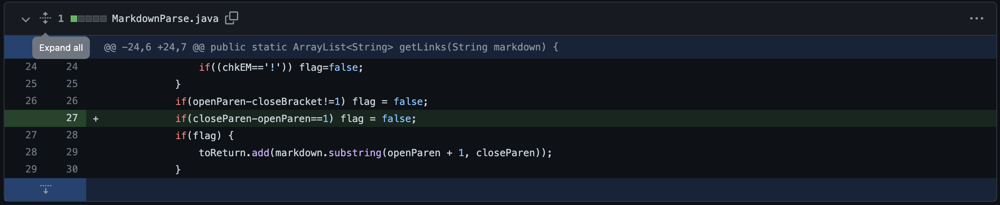
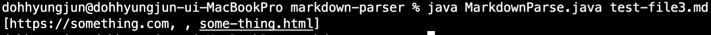

# Hyungjun Doh's Week 4 Lab Report
Show a screenshot of the code change diff from Github (a page like this)  
Link to the test file for a failure-inducing input that prompted you to make that change  
Show the symptom of that failure-inducing input by showing the output of running the file at the command line for the version where it was failing (this should also be in the commit message history)  
Write 2-3 sentences describing the relationship between the bug, the symptom, and the failure-inducing input.  
1. File with an image reference
- code difference  
  
- [Link to the test file for a failure-inducing input](https://github.com/hdoh-ucsd/markdown-parser/blob/main/test-file1.md)  
[symptom for failure-inducing input #1]  

-  There was no bug induced by the program. However, there was a symptom that a file with an image reference such as "something.jpeg" was included in the result. This was a faulty program which considered image tag as a link tag.
***
2.  File that uses [] and (), but very far apart in the file  
- code difference  
  
- [Link to the test file for a failure-inducing input](https://github.com/hdoh-ucsd/markdown-parser/blob/main/test-file2.md)

- There was no bug induced by the program. However, there was a symptom that the test file that uses [] and () with unvalid gap between them. This was a faulty program that should not be printed.
***
3. File with no links
- code difference
  
- [Link to the test file for a failure-inducing input](https://github.com/hdoh-ucsd/markdown-parser/blob/main/test-file3.md)

- There was no bug induced by the program. However, there was a symptom that the test file that added an empty link to the result. This was a faulty program and should be fixed.

