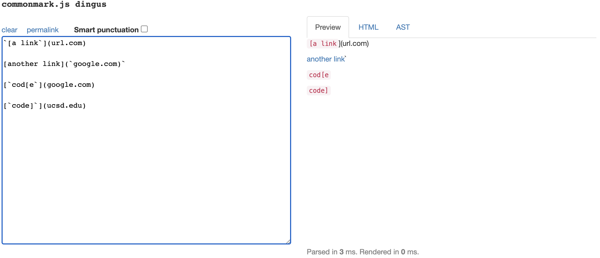
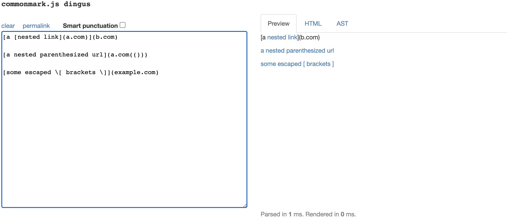
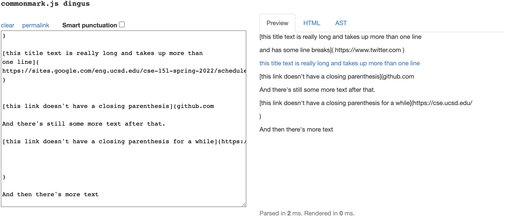
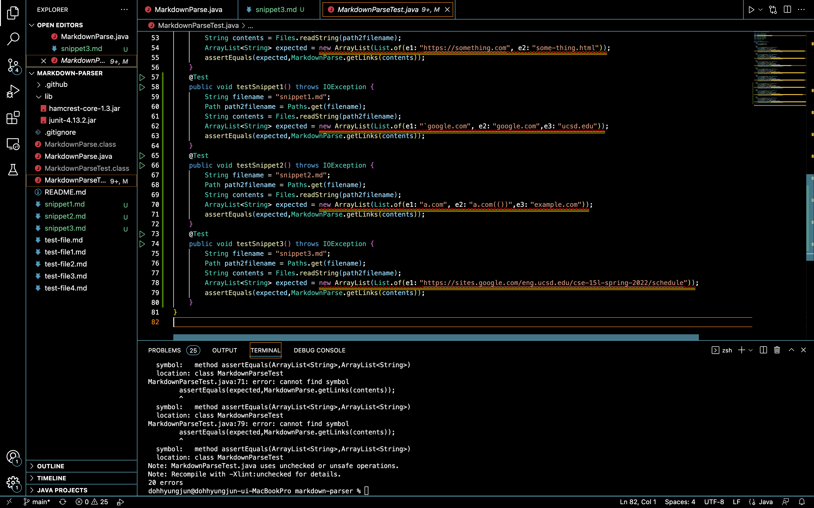
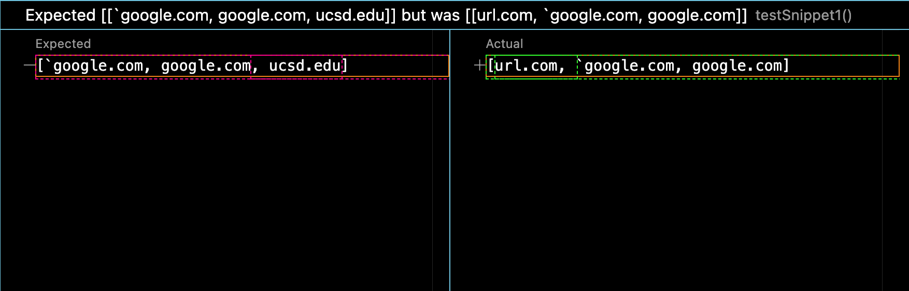
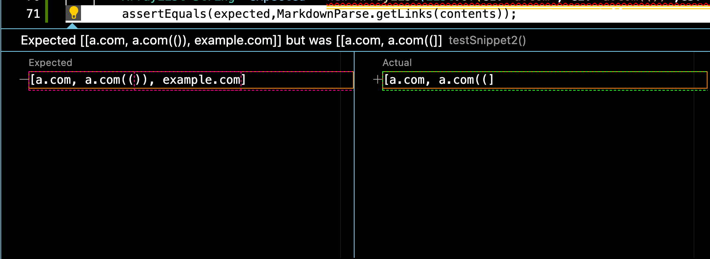
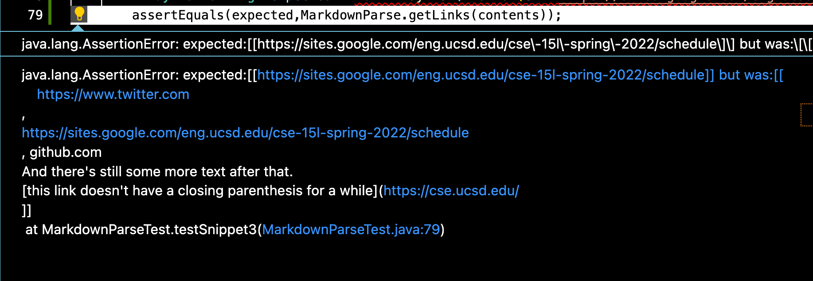
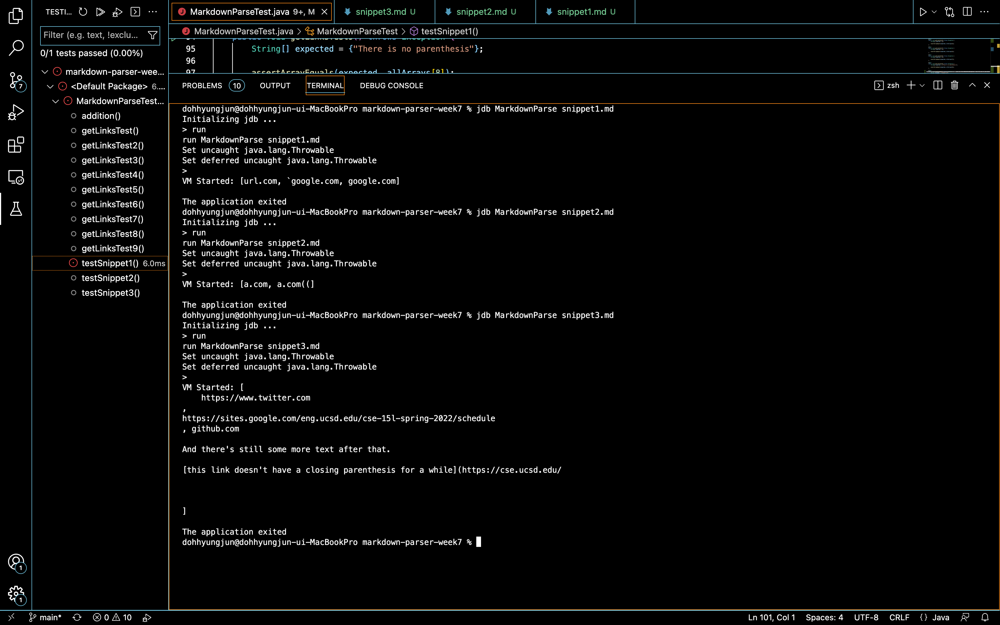

# Hyungjun Doh's Week 8 Lab Report
* A link to your markdown-parse repository and a link to the one you reviewed in week 7  
[link to my markdown-parse repository](https://github.com/hdoh-ucsd/markdown-parser)
[link to repository reviewed in week 7](https://github.com/ima-quack/markdown-parser)
* For each test above:  
    * Decide on what it should produce (i.e., expected output) by using either VScode preview or the CommonMark demo site  
        * Expected output of Snippet 1
      
        * Expected output of Snippet 2
      
        * Expected output of Snippet 3
    

    * Showing the code in MarkdownParseTest.java for how you turned it into a test  
        * the code in my MarkdownParseTest.java
        
    * For your implementation, the corresponding output when running the tests; if it passed, say so. If it didn’t pass, show the specific part of the JUnit output that shows the test failure.  
        * Failure for Snippet 1  
          
        * Failure for Snippet 2  
          
        * Failure for Snippet 3  
          
    * For the implementation you reviewed in Week 7, the corresponding output when running the tests; if it passed, say so. If it didn’t pass, show the specific part of the JUnit output that shows the test failure.  
        * All Failures for Snippets following order accordingly
        
* Answer the following questions with 2-3 sentences each:  
    * Do you think there is a small (<10 lines) code change that will make your program work for snippet 1 and all related cases that use inline code with backticks? If yes, describe the code change. If not, describe why it would be a more involved change.  
        * No, for the first bug "url.com", it would be possible by making a method that excludes any invalid characters before the opening bracket. However, in order to debug the case of "ucsd.edu", I would have to search for another bracket that follows by the one we are searching for - we opened for - and correspond with the matching ending bracket.
    * Do you think there is a small (<10 lines) code change that will make your program work for snippet 2 and all related cases that nest parentheses, brackets, and escaped brackets? If yes, describe the code change. If not, describe why it would be a more involved change.  
        * No, this case is caused by nested parenthesis. As explained above, this would require me to make another method that excludes the cases for any nested parenthesis. One way to do is to iterate a for loop for matching closing parenthesis and reallocate the index when bracket/parenthesis is nested. However, this may cause a Timeout Error.
    * Do you think there is a small (<10 lines) code change that will make your program work for snippet 3 and all related cases that have newlines in brackets and parentheses? If yes, describe the code change. If not, describe why it would be a more involved change.  
        * No, snippet 3 induces multiples symptoms for my algorithm. In order to debug this case, I would have to start with consider the case if there is a long gap between the closing Bracket and the opening Parenthesis. In addition, I would have to consider the next Set of Link to avoid any nested brackets/parenthesis or gap errors.
If your code already works on some/all test cases, include an explanation of what were the code changes that allowed the tests to pass.
